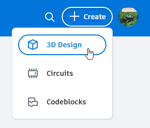
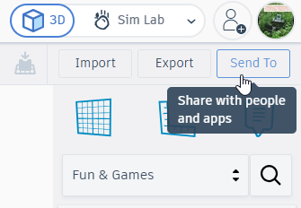
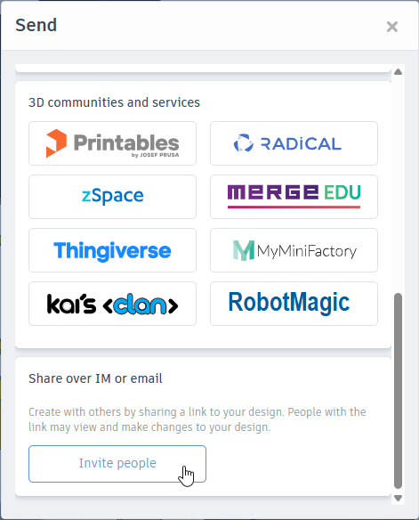
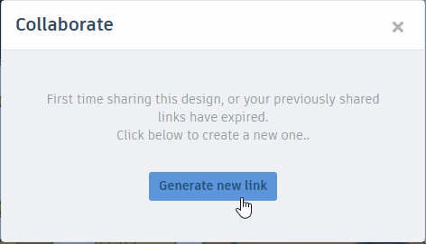
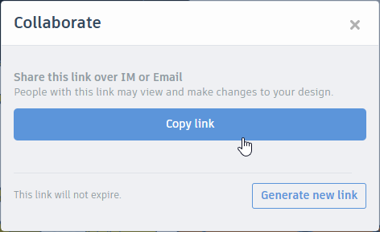

# Warm-Up: 3D Modeling with Tinkercad
In this activity, create a 3D model of something!

## Getting Started: Tinkercad Account
In order to use Tinkercad, an account is required. Luckily, there are already credentials you can use!

Credentials:
- **Username**: `hytostudent@gmail.com`
- **Password**: `C0dingIsFun!`

### Instructions
Follow these steps to get started with a new 3D design:

1. Go to [tinkercad.com/login](https://www.tinkercad.com/login)
1. Click the blue "Personal accounts" button
1. Click the black "Email or Username" button
1. Enter `hytostudent@gmail.com` as the Email, and click "Next"
1. Enter `C0dingIsFun!` as the Password, and click "Sign in"
1. From there, click the "+ Create" button in the upper right
1. Click the "3D Design" option  
  

That's it! Now you have a new canvas upon which to build your three-dimensional hopes and dreams.

## Building Something
Drag and drop the shapes on the right onto the canvas to add them. Put them together to create something interesting!

### Notes
There is a lot you can do with Tinkercad - here are some capabilities:

- When you add shapes, you can change things like **colors, positions, and sizes**.
- You can select existing things by clicking the **dropdown under "Basic Shapes"** and selecting something new.
- You can move around the canvas by **right clicking** - hold **Shift** to pan, and use the **scroll wheel** to zoom.

### Ideas
It may be good to start with some vision for what you want to make - here are some ideas:

- a house or other building
- a car or other vehicle
- an animal or other creature / character

## Submitting
When you're done, submit your work using the form on the [course homepage](../BOOKREADME.md)!

Follow these steps to get a shareable link:

1. Click the "Send To" button in the upper right  
  
1. In the pop-up that appears, scroll down and click the "Invite people" button  
  
1. In the subsequent pop-up, click the "Generate new link" button  
  
1. Finally, click the "Copy link" button!  
  

Now the link should be copied to your keyboard. Head over to the the form on the [course homepage](../BOOKREADME.md) and submit that link!
