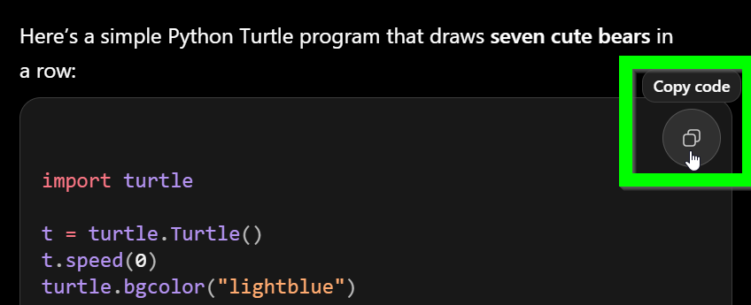
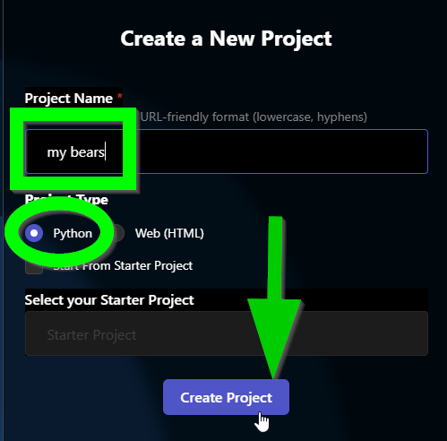

# Warm-Up: Vibe Drawing
In this activity, use A.I. to generate code that makes a drawing!

## Part One: Vibe Coding Python Turtle
First, get some code from ChatGPT.

1. Go to [ChatGPT](https://chatgpt.com)
1. Prompt it with "give me python turtle code that draws a picture of `SOMETHING`"
1. When it finishes spitting out the result, copy the code using the copy button in the upper right of the code block  
  

Now you have some code!

## Part Two: Running the Code
Next, create a new HyTOP Python project and paste the code.

1. Go to the [HyTOP Create Project page](https://hytop.onrender.com/create-project)
1. Enter a project name
1. Select "Python" as the project type  
  
1. In the code editor under **main.py**, paste the code
1. Save the project with `Ctrl`+`S` or clicking the Save button in the upper left

Now you have a drawing!

## Part Three: Iterating
The next step is to basically repeat the steps above. If your drawing isn't what you want, try asking ChatGPT to change it up. Then, copy the code again, remove all the existing code from the project, and paste the new code.

### Side Note: Non-Vibe Coding
This process can get pretty frustrating if the A.I. does not understand what you mean, or makes changes you don't want. Sometimes, it's easier to actually look at the code, try to understand it, and change it yourself instead of relying on A.I.!

## Part Four: SVG
Python Turtle graphics are _one_ way to draw with code, but there are other ways too! One very powerful online graphics tool is [Scalable Vector Graphics, or SVG](https://en.wikipedia.org/wiki/SVG).

Repeat the process above, but with SVG instead of Python! This will require a few key changes:

1. The prompt needs to ask for an **html document that includes an svg element that shows a picture of `SOMETHING`**
1. The HyTOP project has to be a **Web (HTML)** project instead of a Python Project

Try out some different ideas to see what ChatGPT + SVG can do!

## Part Five: Submission
When you have a drawing you like, either through Python + Turtle or HTML + SVG, submit your project! Form linked from the [course homepage](../BOOKREADME.md).
