# Emerging Tech Gallery
Take a look at some of these pictures.

## Wikipedia (Real)
From the very early days of Wikipedia:
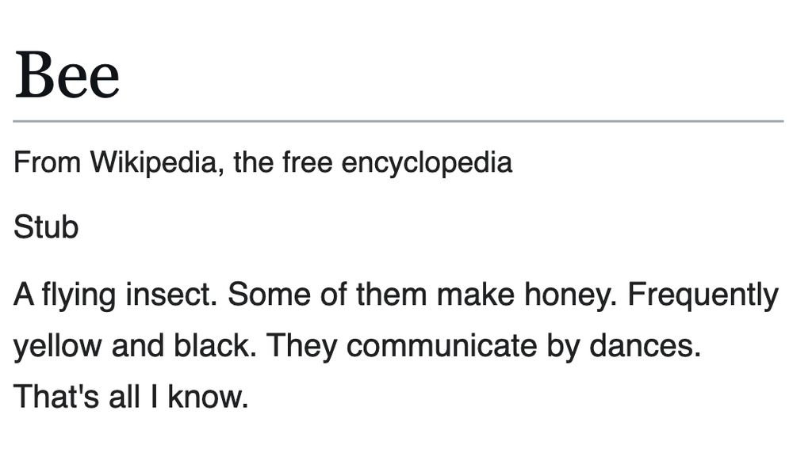

Another example from the early days:
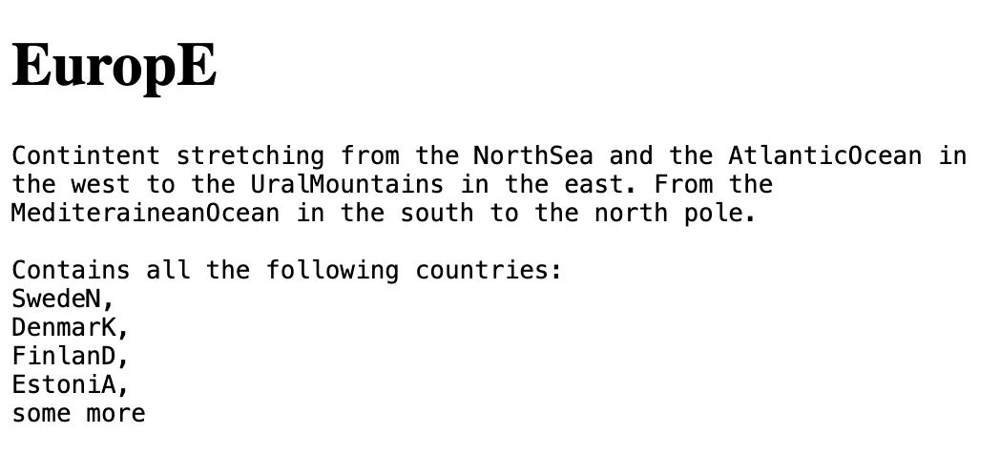

Can you guess who this is?
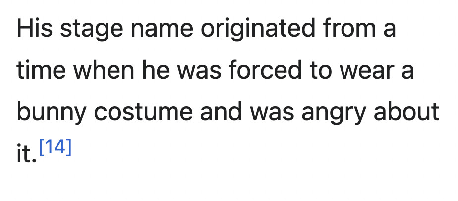

Hegelochus
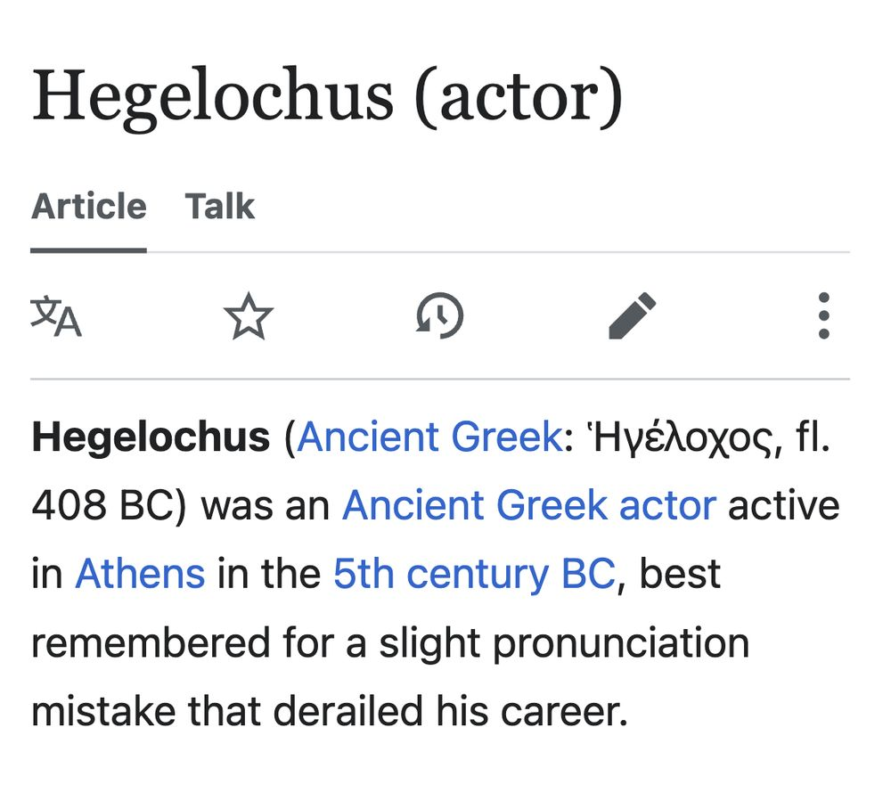

Wet Cat Food

I Voted
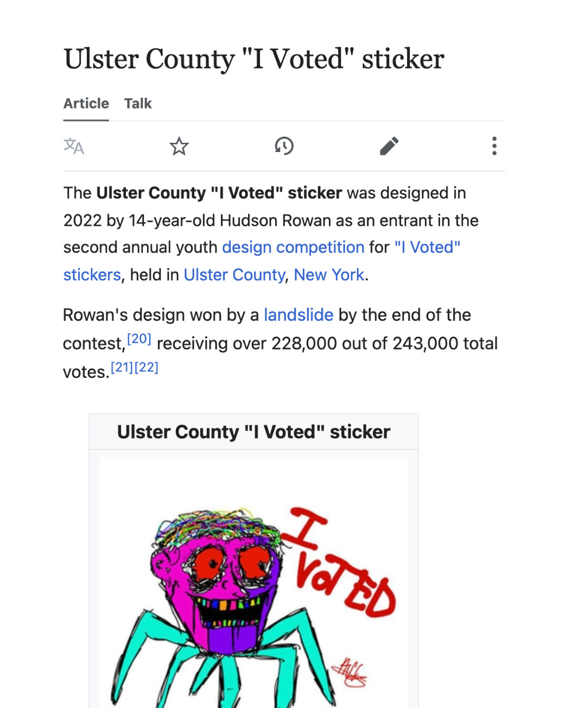

Fifteen Thousand Eggs
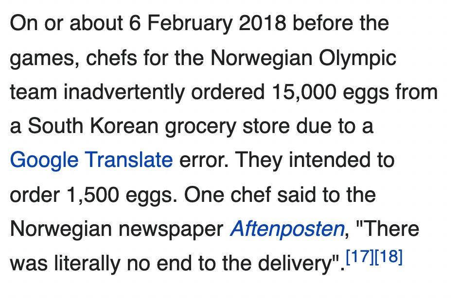

## Wikipedia (Fake)

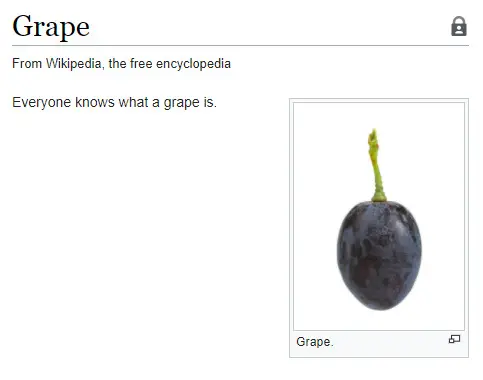

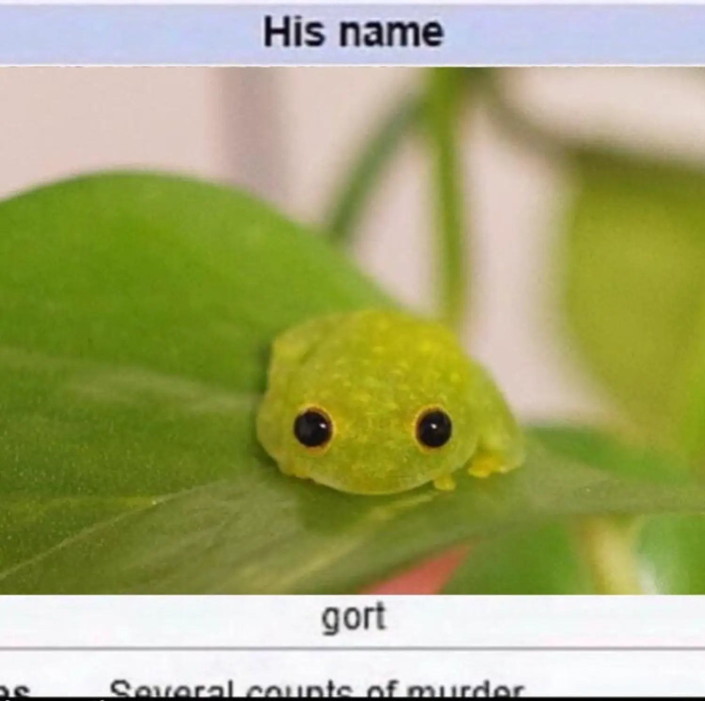

## AI / Tech

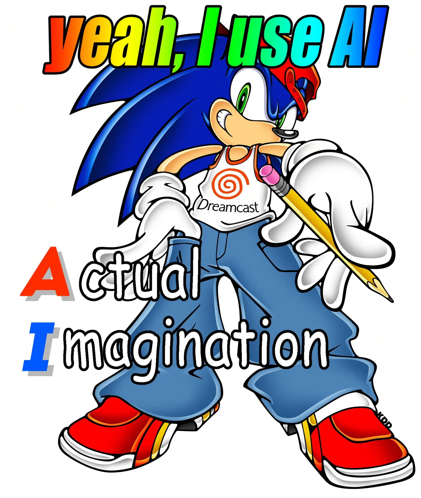

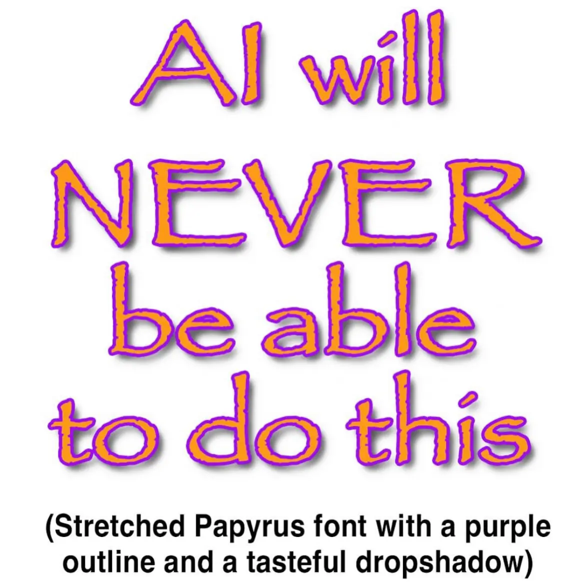

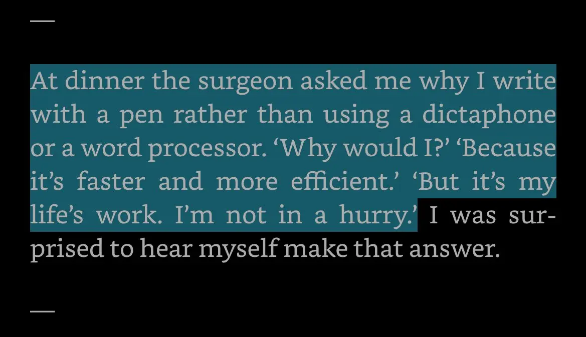

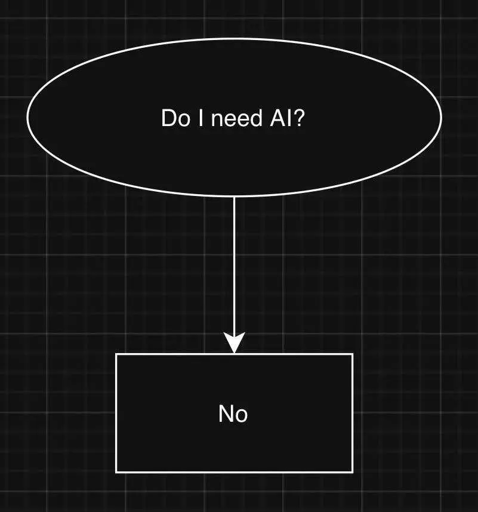

## Learning / Inspiration

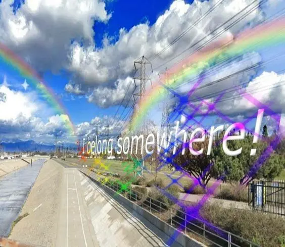

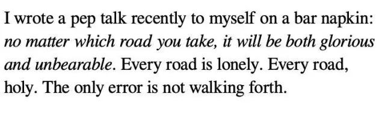

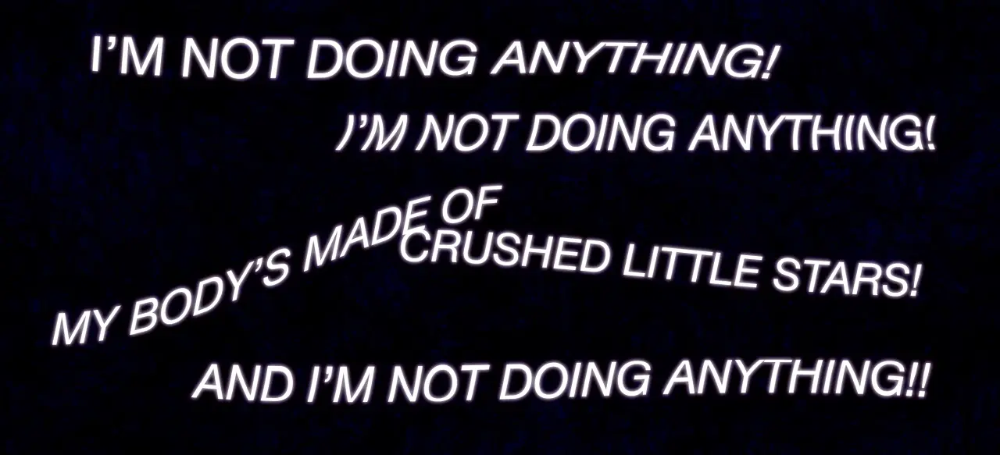

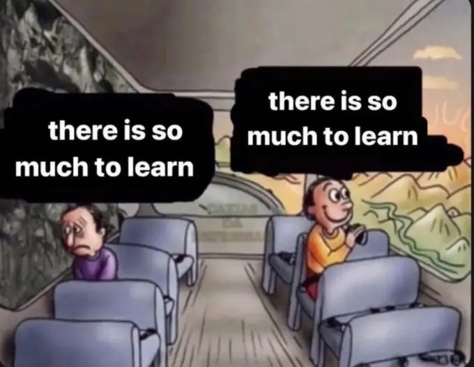

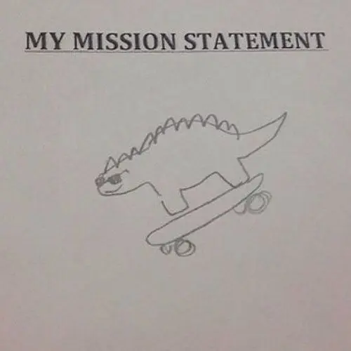

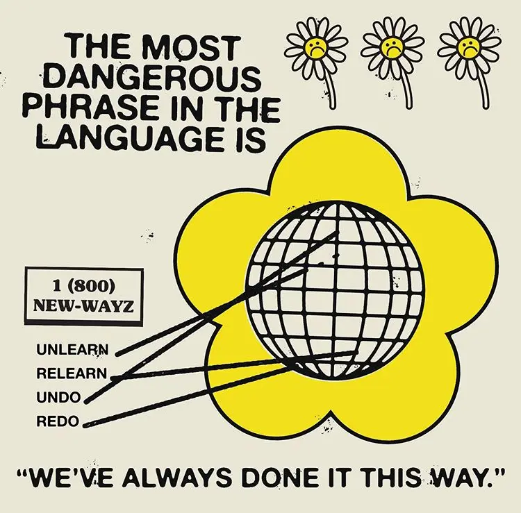
